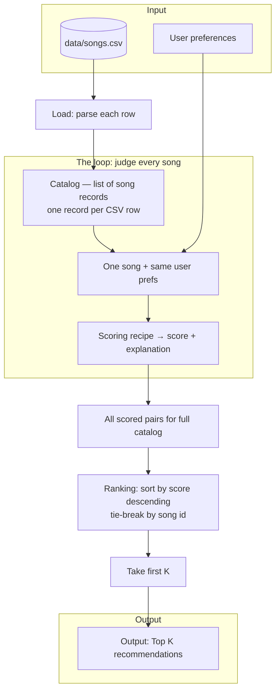

# 🎵 Music Recommender Simulation

## Project Summary

In this project you will build and explain a small music recommender system.

Your goal is to:

- Represent songs and a user "taste profile" as data
- Design a scoring rule that turns that data into recommendations
- Evaluate what your system gets right and wrong
- Reflect on how this mirrors real world AI recommenders

Replace this paragraph with your own summary of what your version does.

---

## How The System Works

Large streaming services blend many signals—collaborative patterns from millions of listeners, rich audio and text features, and session context—to rank what to show next. This project does not simulate that full stack. It prioritizes a **transparent, content-based** slice: each song is described with explicit tags and numeric attributes, a user profile states simple preferences, and a **scoring rule** turns those into a number per song; a **ranking rule** then sorts the catalog and returns the top matches. The goal is to make the data-to-recommendation path easy to inspect and tune, not to match production scale or complexity.

### Plan (documented in this section)

Project planning is captured **here in `README.md`**, under **How The System Works**, rather than in a separate planning document. That keeps design, data definitions, and behavior in one place.

At a high level, the plan is:

1. **Catalog** — Treat `data/songs.csv` as the full set of songs; each row is one `Song`-shaped record after load.
2. **Profile** — Use a small **user preference** dictionary (aligned with `UserProfile`) as the fixed target for scoring runs.
3. **Score** — Apply the **Algorithm recipe (final)** below to **every** song: same rules, same weights, no special cases per row.
4. **Rank** — Sort by total score, take **top `k`**, attach short explanations for transparency.
5. **Evaluate** — Run tests and informal checks; document weight tweaks under **Experiments** once implementation exists.

The **Algorithm recipe** subsection below is **finalized** for this simulation: it is the specification to implement in `src/recommender.py` unless you deliberately revise it and record the change here.

**`Song` (simulation features)** — loaded from the catalog for each track:

- `id`, `title`, `artist`
- `genre`, `mood`
- `energy`, `tempo_bpm`, `valence`, `danceability`, `acousticness`

**`UserProfile` (simulation features)** — what the recommender assumes about taste:

- `favorite_genre`, `favorite_mood`
- `target_energy`
- `likes_acoustic`

**Scoring and ranking** — The `Recommender` (and the `recommend_songs` helper in `src/recommender.py`) computes a **score for each song** by combining how well its **genre** and **mood** match the user’s favorites, how close its **energy** (and optionally other numeric fields) is to **`target_energy`** using a distance-based subscore—not “higher energy is always better”—and how its **acousticness** aligns with **`likes_acoustic`**. To **recommend**, the system **sorts all songs by that score** (highest first) and returns the **top `k`** (default 5). The functional API also attaches a short **explanation** string per result so you can see why a song ranked where it did.

### Algorithm recipe (final)

These are the **specific rules** the program uses to compute one **score per song**, then rank the catalog.

| Rule | Points | Notes |
|------|--------|--------|
| **Genre match** | **+2.0** if `song.genre == user.favorite_genre` | Strong signal: genre is the broad “style bucket” and is relatively **sparse** in `songs.csv` (each label appears on few tracks). |
| **Mood match** | **+1.0** if `song.mood == user.favorite_mood` | Weaker than genre: **mood repeats across genres** (e.g. `chill` appears on lofi *and* ambient), so it should not outweigh genre alone. |
| **Energy similarity** | **+3.0 × (1 − \|song.energy − target_energy\|)** | Rewards **closeness** to the user’s target, not “higher is better.” Max **+3.0** when energies match; **0** when they are as far apart as possible on the 0–1 scale. |
| **Acoustic preference** (optional) | **+1.0** if aligned: `likes_acoustic` and `song.acousticness ≥ 0.5`, **or** not `likes_acoustic` and `song.acousticness < 0.5`; else **0** | Ties break toward studio vs organic feel without dominating genre. |

**Total score** = sum of applicable rows above (no negative terms in this starter recipe).

**Ranking rule:** compute that total for **every** song in the catalog, **sort descending** by score, **tie-break** by `song.id` ascending for stability, return the **first `k`**.

**Genre vs mood weighting:** With **+2.0** vs **+1.0**, a song that matches **genre only** still scores higher than a song that matches **mood only** alone (2 points vs 1). That matches the intent: *style* is the anchor, *mood* refines. If both match, the genre+mood stack (+3) clearly beats a wrong-genre track that only happens to share mood or energy. On a **tiny** catalog, you can tune these (e.g. `1.5` / `1.5`) if you want more discovery across genres—see experiments below.

### Expected biases (from this design)

These are predictable skews from the **finalized recipe**, not bugs:

- **Genre-first bias** — A higher weight on genre match can **bury strong tracks in other genres** that still fit the user’s mood, energy, or acoustic taste. Example: a perfect **mood + energy** match may lose to a mediocre same-genre track that only checks the genre box.
- **Exact-tag bias** — Mood and genre are **exact string matches**. Songs that feel “chill” but use a different label (e.g. `relaxed`) get **no mood bonus**, so the system can underrate subjectively similar music.
- **Energy dominance** — Energy similarity can contribute up to **+3.0** points, comparable in scale to genre + mood combined. That can **reorder** lists in ways that feel like “energy over story,” especially if `target_energy` is extreme.
- **Small catalog** — With few rows per genre, recommendations may **repeat a narrow band** of artists or **over-represent** whichever genre has the most near-matches to the profile.

Document any changes to weights here so biases shift in known ways when you experiment.

### Data flow (mental map)

1. **Input** — User preferences (target genre, mood, energy, acoustic taste) **plus** the catalog file `data/songs.csv`.
2. **Process** — Load the CSV into a list; **for each song**, run the same scoring recipe against the same user prefs (no song skipped).
3. **Output** — **Ranking:** sort all `(song, score, …)` pairs by score, then take the **top `K`** as the final recommendation list.

*Single-song path:* one **row** in the CSV becomes one **song record** in memory → that record and the user prefs go into the **scoring rules** → you get one **numeric score** (and explanation) → that pair joins the full list → after every row is processed, **sorting** assigns its **rank** among all songs.



The **Process** box is repeated conceptually for each catalog item: every row takes the same path from **song record** → **score** before the list is sorted.

---

## Getting Started

### Setup

1. Create a virtual environment (optional but recommended):

   ```bash
   python -m venv .venv
   source .venv/bin/activate      # Mac or Linux
   .venv\Scripts\activate         # Windows

2. Install dependencies

```bash
pip install -r requirements.txt
```

3. Run the app:

```bash
python -m src.main
```

### CLI sample output

Example terminal output from `python -m src.main` (ranked scores and scoring reasons):


### Running Tests

Run the starter tests with:

```bash
pytest
```

You can add more tests in `tests/test_recommender.py`.

---

## Experiments You Tried

Use this section to document the experiments you ran. For example:

- What happened when you changed the weight on genre from 2.0 to 0.5
- What happened when you added tempo or valence to the score
- How did your system behave for different types of users

---

## Limitations and Risks

Summarize some limitations of your recommender.

Examples:

- It only works on a tiny catalog
- It does not understand lyrics or language
- It might over favor one genre or mood

You will go deeper on this in your model card.

---

## Reflection

Read and complete `model_card.md`:

[**Model Card**](model_card.md)

Write 1 to 2 paragraphs here about what you learned:

- about how recommenders turn data into predictions
- about where bias or unfairness could show up in systems like this


---

## 7. `model_card_template.md`

Combines reflection and model card framing from the Module 3 guidance. :contentReference[oaicite:2]{index=2}  

```markdown
# 🎧 Model Card - Music Recommender Simulation

## 1. Model Name

Give your recommender a name, for example:

> VibeFinder 1.0

---

## 2. Intended Use

- What is this system trying to do
- Who is it for

Example:

> This model suggests 3 to 5 songs from a small catalog based on a user's preferred genre, mood, and energy level. It is for classroom exploration only, not for real users.

---

## 3. How It Works (Short Explanation)

Describe your scoring logic in plain language.

- What features of each song does it consider
- What information about the user does it use
- How does it turn those into a number

Try to avoid code in this section, treat it like an explanation to a non programmer.

---

## 4. Data

Describe your dataset.

- How many songs are in `data/songs.csv`
- Did you add or remove any songs
- What kinds of genres or moods are represented
- Whose taste does this data mostly reflect

---

## 5. Strengths

Where does your recommender work well

You can think about:
- Situations where the top results "felt right"
- Particular user profiles it served well
- Simplicity or transparency benefits

---

## 6. Limitations and Bias

Where does your recommender struggle

Some prompts:
- Does it ignore some genres or moods
- Does it treat all users as if they have the same taste shape
- Is it biased toward high energy or one genre by default
- How could this be unfair if used in a real product

---

## 7. Evaluation

How did you check your system

Examples:
- You tried multiple user profiles and wrote down whether the results matched your expectations
- You compared your simulation to what a real app like Spotify or YouTube tends to recommend
- You wrote tests for your scoring logic

You do not need a numeric metric, but if you used one, explain what it measures.

---

## 8. Future Work

If you had more time, how would you improve this recommender

Examples:

- Add support for multiple users and "group vibe" recommendations
- Balance diversity of songs instead of always picking the closest match
- Use more features, like tempo ranges or lyric themes

---

## 9. Personal Reflection

A few sentences about what you learned:

- What surprised you about how your system behaved
- How did building this change how you think about real music recommenders
- Where do you think human judgment still matters, even if the model seems "smart"

